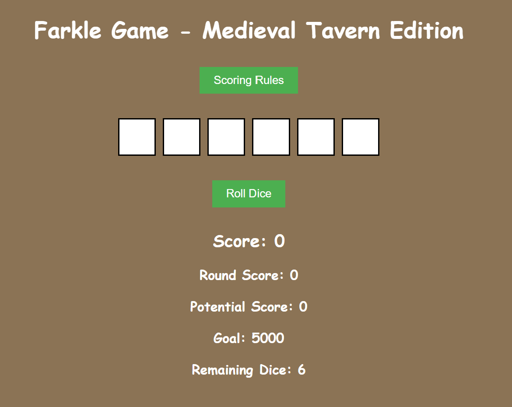
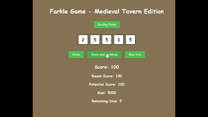
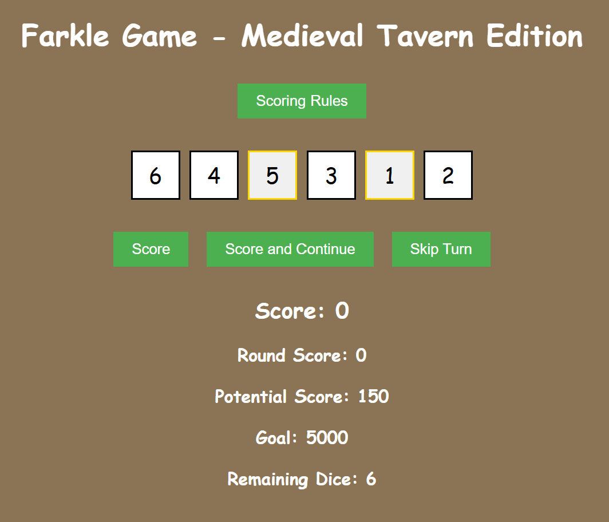

# Farkle Game - Medieval Tavern Edition




## Table of Contents
1. [Introduction](#introduction)
2. [Why I Built This](#why-i-built-this)
3. [Features](#features)
4. [Progress So Far](#progress-so-far)
5. [Known Bugs](#known-bugs)
6. [Future Ideas](#future-ideas)
7. [Technologies Used](#technologies-used)
8. [How to Run the Project](#how-to-run-the-project)
9. [Contributing](#contributing)
10. [License](#license)

---

## Introduction
Farkle Game - Medieval Tavern Edition is a digital adaptation of the classic dice game Farkle, inspired by the medieval world of *Kingdom Come: Deliverance*. This project combines game logic, animations, and a medieval-themed UI to create an immersive single-player experience with an AI opponent.

---

## Why I Built This
I wanted to create a portfolio project that showcases my skills in React, game development, and UI/UX design. Farkle is a fun and challenging game, and adding a medieval tavern theme allows me to explore creative design and animations. This project also helps me practice state management, game logic, and integrating sound and animations into a web app.

---

## Features
### Implemented
- Basic dice rolling and display.
- Scoring rules for single dice and combinations.
- Player and AI turn mechanics.
- Medieval-themed UI with a tavern background.
- "Score," "Score and Continue," and "Skip Turn" buttons.
- Dynamic dice pool that updates after scoring.

### Planned
- Smooth dice rolling animations.
- Sound effects for dice rolls and game interactions.
- AI opponent with varying difficulty levels.
- Victory screen and game-over animations.
- Rogue-like progression with money, badges, and drinks.

---

## Progress So Far
- Set up the React app and folder structure.
- Implemented core game logic for dice rolling and scoring.
- Created a basic UI with a medieval tavern theme.
- Added player and AI turn mechanics.
- Implemented "Score," "Score and Continue," and "Skip Turn" buttons.
- Added dynamic dice pool updates after scoring.

---

## Known Bugs
- The dice pool sometimes resets to all 1s after scoring.
- The "Roll Dice" button doesn't always disappear after rolling.
- Potential score calculation doesn't always match Farkle rules.
- Selected dice don't always disappear after scoring.

---

## Future Ideas
- Add multiplayer functionality using WebSockets.
- Introduce different AI difficulty levels (e.g., easy, medium, hard).
- Create a tutorial mode for new players.
- Add more medieval-themed sound effects and music.
- Implement a leaderboard to track high scores.
- Add rogue-like progression with money, badges, and drinks.

---

## Technologies Used
- **Frontend**: React, Framer Motion (for animations), Howler.js (for sound effects).
- **Styling**: CSS, Styled Components.
- **Backend**: Node.js (optional for future multiplayer).
- **Tools**: Git, GitHub, Visual Studio Code.

---

## How to Run the Project

### 1. Clone the repository:
```bash
git clone https://github.com/DominicTalbot/farkle-game.git
```

### 2. Navigate to the project directory:
```bash
cd farkle-game
```

### 3. Install dependencies:
```bash
npm install
```

### 4. Start the development server:
```bash
npm start
```

### 5. Open your browser and visit:
```
http://localhost:3000
```

---

## Contributing
Contributions are welcome! If you'd like to contribute, please follow these steps:

1. Fork the repository.
2. Create a new branch for your feature or bugfix.
3. Submit a pull request with a detailed description of your changes.

---

## License
This project is licensed under the MIT License. See the [LICENSE](LICENSE) file for details.

---

## Screenshots



---

## Acknowledgments
- Inspired by the classic game Farkle and the medieval world of *Kingdom Come: Deliverance*.

---

### **Key Features of This README**
1. **Badges**: Visual indicators for technologies and license.
2. **Table of Contents**: Easy navigation for readers.
3. **Sections**: Clear breakdown of the project’s purpose, progress, and future plans.
4. **Screenshots**: Placeholders for adding visuals of your game.
5. **Contributing and License**: Open-source friendly.
